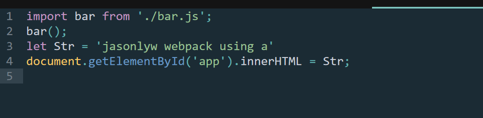

## webpack 入门操作
> 基本总结
1. webpack中的四个概念(非常重要)
    entry: webpack打包的入口
    output: webpack打包生成什么
    module: 模块文件
    bundle/chunk: webpack打包n个关联的module生成的文件
2. webpack模块化打包的基本流程  连接: webpack从入口JS开始, 递归查找出所有相关联的模块, 并`连接`起来形成一个图(网)的结构
	编译: 将JS模块中的模块化语法`编译`为浏览器可以直接运行的模块语法(当然其它类型资源也会处理)
	合并: 将图中所有编译过的模块`合并`成一个或少量几个bundle文件, 而浏览器运行是打包生成的bundle文件 

3. webpack的基本配置和命令

4. 打包命令 webpack 

### 基本操作图片流程

# 待解决的问题
> 1). webpack本身只能打包JS, 而项目中的css/img等资源如何打包?
  2). 页面能不能自动引入动态生成的打包JS/CSS